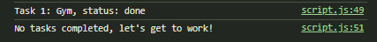
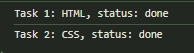
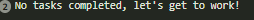

# 🗂️ Kanban Board

**Kanban Board** built from a **Figma design**, using **HTML** and **CSS**.  
The board allows users to visualize tasks across different stages: **TODO**, **DOING**, and **DONE**.

---

## 🔹 Overview

This project is a **Kanban Board** where tasks are visually organized into columns.  
It was designed from a **Figma UI design**.

---

## ✨ Features

✅ **Navigation Sidebar** — Displays logo, available boards, and buttons  
✅ **Task Columns** — Tasks grouped into **TODO**, **DOING**, and **DONE**  
✅ **Hover Effects** — Interactive button styles
✅ **Pixel-perfect UI** — Matches the provided Figma design  
✅ **Responsive Layout** — Optimized for **desktop**, **tablet**, and **mobile**  
✅ **Custom Google Font** — Uses _Plus Jakarta Sans_ for a modern look

---

## 🚀 Installation & Usage

### 1. Clone the repository

git clone https://github.com/Lindokuhle-dumakude/LINDUM25535_FTO2506_GroupB_Lindokuhle_Dumakude_JSL01.git

cd LINDUM25535_FTO2506_GroupB_Lindokuhle_Dumakude_JSL01

Open Browser - Double click index.html file.

---

## 🔮 Future Improvements

- Add **Hamburger menu** for mobile responsiveness

---

## 🧩 JavaScript Functionality

This project includes a simple **task input and status validation system** implemented in JavaScript.  
The code allows the user to **enter two tasks** and stores their details using prompts.

### **Technologies used**

- JSL 🧩

### **How It Works**

1. The program declares variables to store **task titles**, **descriptions**, and **statuses** for two tasks.
2. It uses a **for loop** to:
   - Prompt the user to enter the **task title**
   - Prompt the user to enter the **task description**
   - Prompt the user to enter the **task status** (`todo`, `doing`, or `done`)
3. Input validation ensures that the **status** can only be `"todo"`, `"doing"`, or `"done"`.  
   If the user enters an invalid status, they are prompted again until a valid value is entered.
4. Once the user enters all the information:
   - If the task’s status is `"done"`, the program **logs the task details** to the console.
   - If the task isn’t marked as done, the program outputs:  
     **"No tasks completed, let's get to work!"**

### **Example Output**

---
